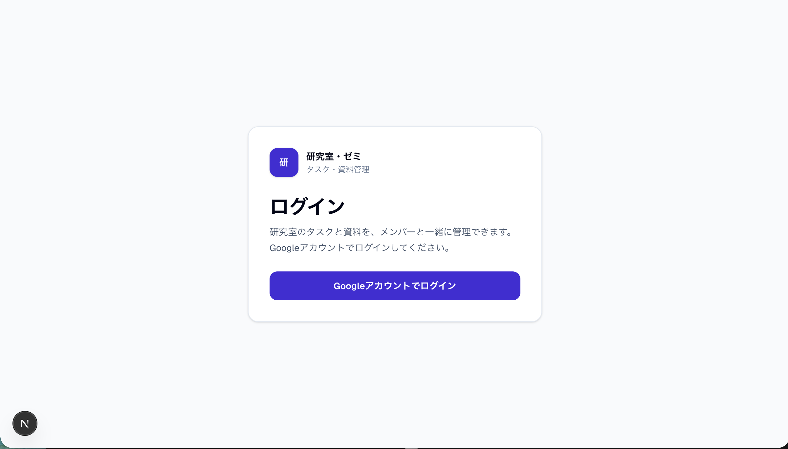
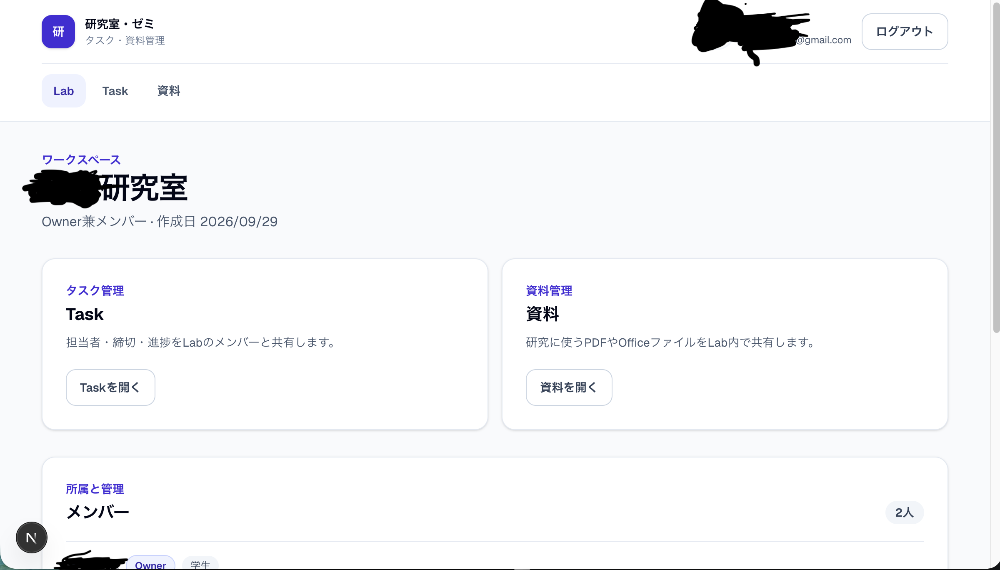
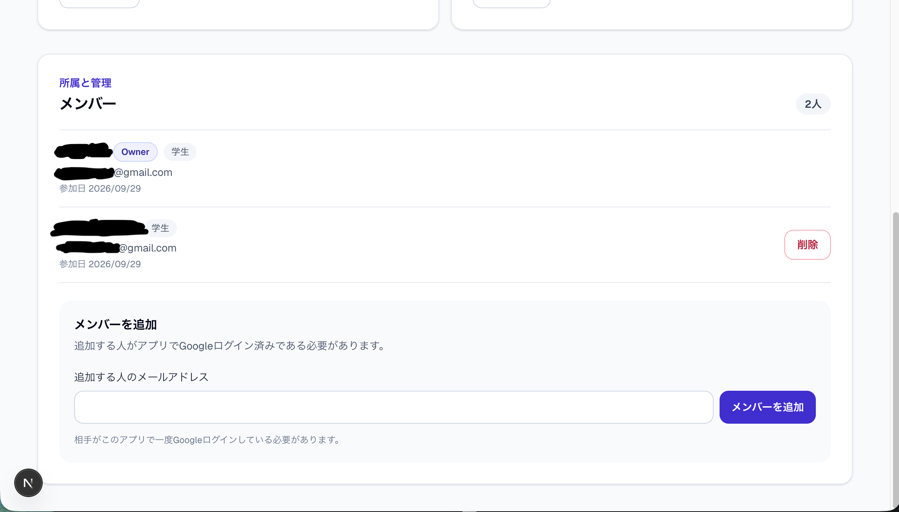
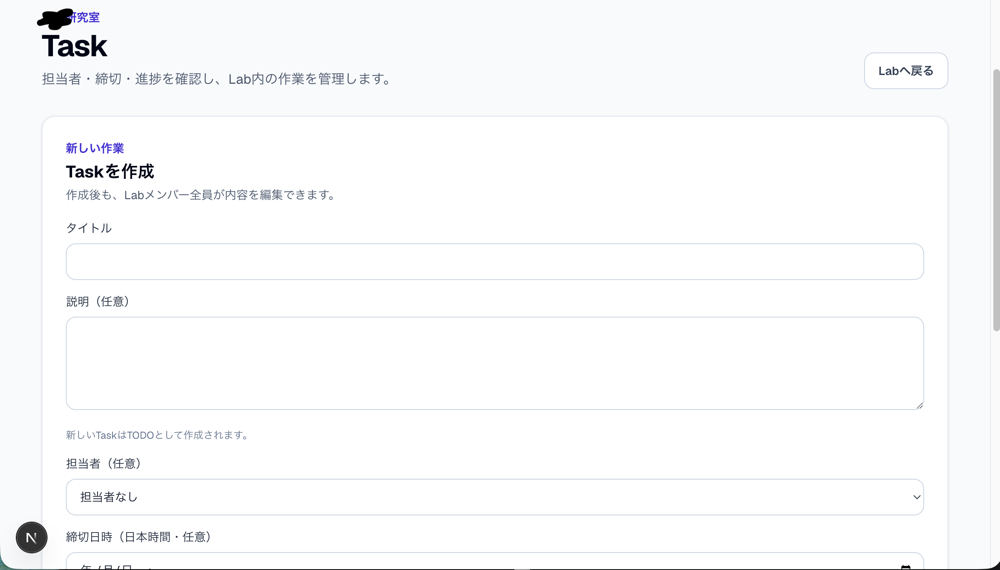
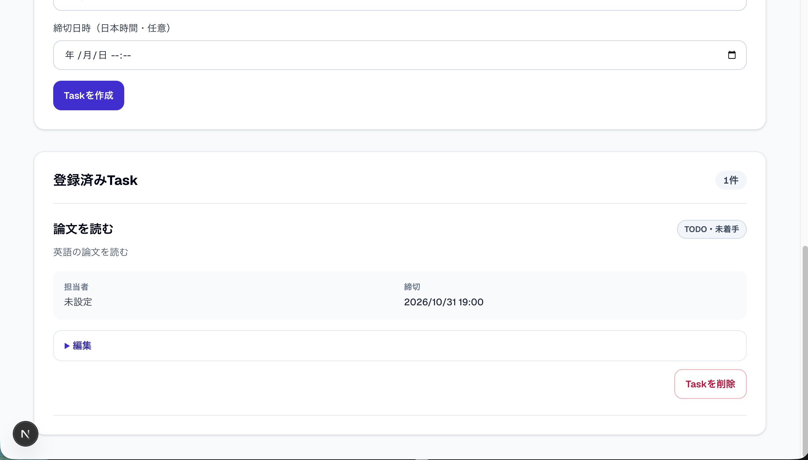
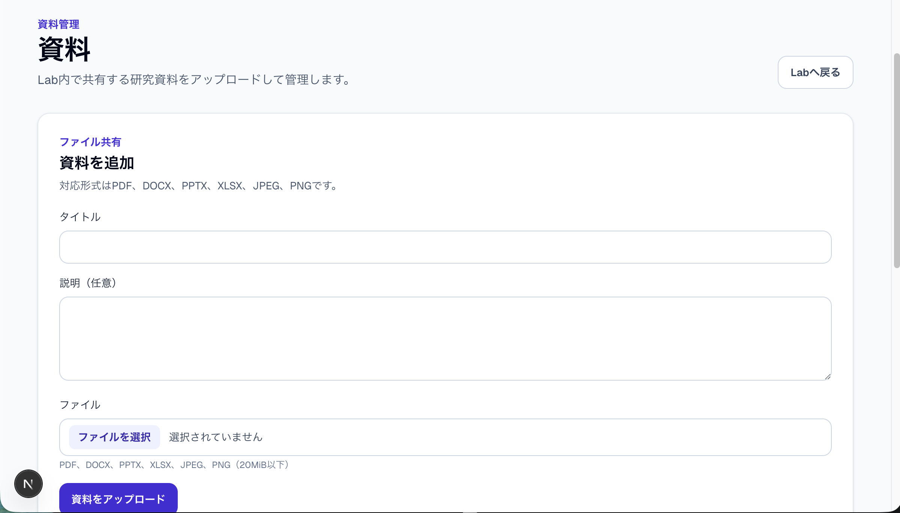
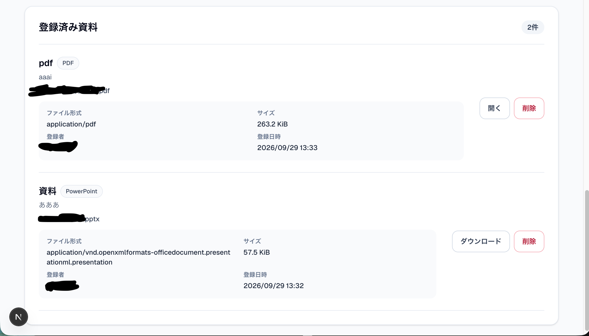
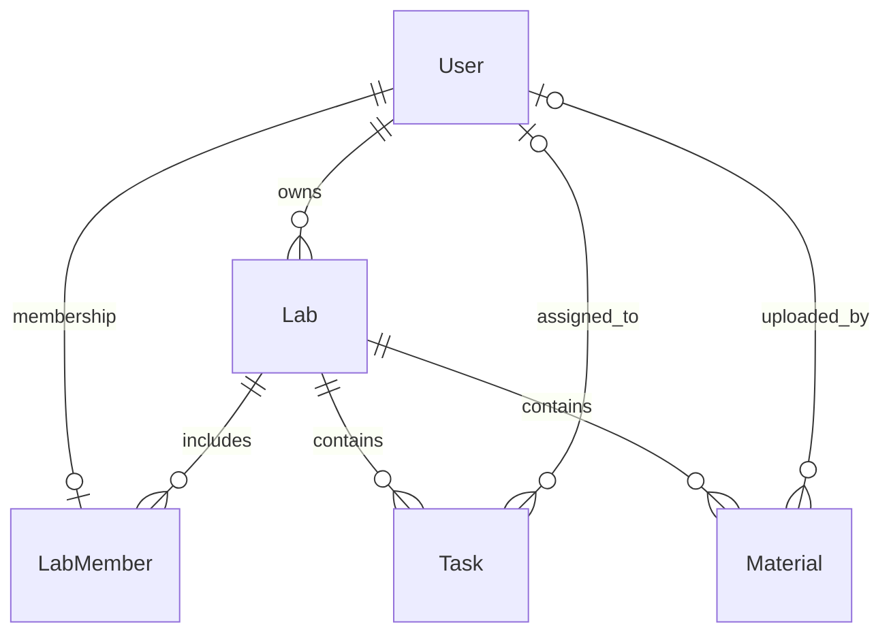

# 研究室・ゼミ向け タスク・資料管理アプリ

研究室やゼミのメンバーが、Lab単位でタスクと資料を共有するWebアプリです。

## 概要

タスク、担当者、締切、進捗、共有資料をLabごとにまとめて管理します。研究室やゼミでは、作業内容や資料が複数の場所に分かれると、担当や期限を追いにくくなります。このアプリではGoogleアカウントでログインしたメンバーが、同じLabの情報を共有できます。

## 制作背景

研究室・ゼミの共同作業では、タスク、担当、締切、資料を一か所で確認できると、メンバー間で状況を共有しやすくなります。タスク管理と資料共有をLab単位にまとめ、メンバーの所属に沿ったアクセス制御も学べる題材として制作しました。

## 主な機能

- **ログインとプロフィール** — Google OAuthでログインし、教員・学生の区分を設定します。学生は学生番号が必要です。ログアウトもできます。
- **Labとメンバー** — Lab未所属のユーザーがLabを作成します。作成者はOwner兼Memberになります。Ownerは、アプリに登録済みのユーザーをメールアドレスで追加・削除できます。
- **Task管理** — Lab内のメンバーがTaskを作成・編集・削除できます。タイトル、説明、`TODO`・`IN_PROGRESS`・`DONE`のstatus、担当者、締切を設定します。
- **Material管理** — PDF、DOCX、PPTX、XLSX、JPEG、PNGをアップロードし、Lab内の資料一覧から管理できます。PDFと画像はブラウザーで開き、Officeファイルはダウンロードします。アップロード上限は1ファイル20MiBです。

## 画面イメージ

### Login



### Lab



### Member



### Task





### Material





## 技術スタック

| 分類 | 技術 |
| --- | --- |
| Runtime | Node.js 24（`.nvmrc`） |
| Web | Next.js 16.3.6、React 19、TypeScript 5 |
| UI | Tailwind CSS 4 |
| 認証 | Auth.js（`next-auth` v5 beta）、Google OAuth、Prisma Adapter |
| DB | Prisma ORM 7、PostgreSQL 18（Docker Compose） |
| ファイルストレージ | AWS SDK for JavaScript v3（S3 Client）、SeaweedFS 4.48 |
| 開発環境 | Docker Compose、npm |

## アーキテクチャ

```text
Browser
  ↓
Next.js App Router
  ├─ Auth.js ── Google OAuth
  ├─ Server Components / Server Actions
  │      └─ Prisma ── PostgreSQL
  └─ Material Route Handler
         └─ AWS SDK for JavaScript (S3) ── SeaweedFS
```

画面の読み取りは主にServer Components、更新はServer Actionsで行います。Materialのファイル取得は認可を確認するRoute Handlerを通します。

## DB設計



- `LabMember`は所属日時を持つ明示的な関係モデルです。`userId`の一意制約により、1 Userが所属できるLabは最大1つです。
- Lab作成時は、LabとOwnerの`LabMember`を同じトランザクションで作成します。アプリ上のOwnerはLabのMemberでもあります。
- TaskとMaterialはそれぞれ必ず1つのLabに属します。担当者とMaterial登録者は任意です。
- Auth.js Adapter用の`Account`と`Session`もDBに保存します。図では主要な業務モデルを優先しています。

詳細は[`docs/database.md`](docs/database.md)を参照してください。

## 認証と認可

Google OAuthはユーザーの認証に使い、Labへのアクセス権はLab所属とOwner情報から別に判定します。Auth.jsのDB Sessionを利用し、プロフィール完了前はLab機能へ進めません。

Labの読み取り・更新、Server Action、Material Route Handlerでは、サーバー側で対象Labへの所属を確認します。メンバーの追加・削除はOwnerに限定し、Taskの担当者も同じLabのメンバーに限ります。ボタンの表示制御だけを認可として扱いません。非所属Labは存在の有無を区別しない404相当の応答にします。

## 設計上の工夫

- **TaskのLab境界** — Task操作ではTask IDだけに依存せず、対象Labとユーザーの所属を併せて確認します。担当者は同じLabのメンバーだけを設定できます。statusはEnumで管理し、締切は`Asia/Tokyo`で入力・表示します。
- **所属の整合性** — 1 User 1 Labを`LabMember.userId`のDB一意制約で支えます。LabとOwnerのMember作成、メンバー削除時の担当解除と所属削除は、それぞれトランザクションで行います。
- **DBとファイルの分担** — PostgreSQLにはMaterialのメタデータを保存し、ファイル本体はprivateなS3互換ストレージのSeaweedFSへ保存します。ストレージキーはサーバーで生成し、S3 endpointをブラウザーに公開しません。
- **ストレージ失敗への対応** — アップロード後のDB登録に失敗した場合はオブジェクト削除を試みます。削除時にストレージ側で失敗した場合はDB行を残し、再試行できるようにします。

## Materialの検証範囲

アップロードでは20MiB上限と、拡張子・ブラウザー提供MIME typeの組み合わせを確認します。ファイル内容のマジックバイト検査やウイルススキャンは行っていません。この形式確認だけでファイルの安全性を完全に保証するものではありません。

## セットアップ

### 必要なもの

- Node.js 24とnpm
- Docker Compose
- Google CloudのOAuth Webクライアント

GitHubのClone URLでリポジトリをcloneし、プロジェクトディレクトリで次を実行します。

```bash
nvm install
nvm use
npm ci
cp .env.example .env
```

`.env`にPostgreSQL、SeaweedFS、Auth.js、Google OAuthの設定を行います。環境変数名と用途は後述の表を参照してください。`.env.example`の認証・接続値はローカル開発用であり、本番用として使わないでください。`AUTH_SECRET`はローカルで生成し、`.env`の外へ出したりコミットしたりしないでください（例: `openssl rand -base64 32`）。

Google Cloud ConsoleでOAuth Client IDの種類にWeb applicationを選び、次のoriginとredirect URIを登録します。

```text
Authorized JavaScript origin: http://localhost:3000
Authorized redirect URI:      http://localhost:3000/api/auth/callback/google
```

開発時は`http://localhost:3000`を使用してください。`127.0.0.1`ではcallback URIが一致せず、`redirect_uri_mismatch`になります。

PostgreSQLとSeaweedFSを起動し、Prisma Clientを生成してmigrationを適用します。

```bash
docker compose up -d
npm run db:generate
npx prisma migrate deploy
npm run dev
```

ブラウザーで<http://localhost:3000>を開きます。停止時は開発サーバーのターミナルで`Ctrl+C`を押し、必要に応じて次でDockerサービスを停止します。

```bash
docker compose down
```

`docker compose down -v`はDBとSeaweedFSのデータボリュームも削除するため、通常の停止には使わないでください。

## 環境変数

値はREADMEに記載せず、用途だけを示します。設定例は[`.env.example`](.env.example)を参照してください。

| 変数 | 用途 |
| --- | --- |
| `POSTGRES_DB` | PostgreSQLのDB名 |
| `POSTGRES_USER` | PostgreSQL接続ユーザー |
| `POSTGRES_PASSWORD` | PostgreSQL接続パスワード |
| `POSTGRES_PORT` | ホスト側のPostgreSQLポート |
| `DATABASE_URL` | PrismaのPostgreSQL接続URL |
| `S3_ENDPOINT` | SeaweedFS S3互換endpoint |
| `S3_ACCESS_KEY_ID` | S3接続用Access Key ID |
| `S3_SECRET_ACCESS_KEY` | S3接続用Secret Access Key |
| `S3_BUCKET` | Material保存先bucket |
| `S3_REGION` | S3互換クライアントのregion設定 |
| `AUTH_SECRET` | Auth.jsのセッション署名・暗号化用secret |
| `AUTH_GOOGLE_ID` | Google OAuth Client ID |
| `AUTH_GOOGLE_SECRET` | Google OAuth Client Secret |

## テスト・動作確認

自動検証ではNode.js標準の`node:test`によるテスト、ESLint、TypeScript確認、Next.js buildを使います。実ブラウザーのE2Eは手動確認であり、自動ブラウザーE2Eテストは導入していません。

| 確認方法 | コマンド・範囲 | 結果 |
| --- | --- | --- |
| Lint | `npm run lint` | PASS |
| TypeScript | `npx tsc --noEmit` | PASS |
| Unit / logic tests | `node --test` | PASS（82件） |
| Production build | `npx next build --webpack` | PASS |
| Patch whitespace | `git diff --check` | PASS |
| 手動ブラウザーE2E（主要導線） | Google OAuth、Profile、Lab、Member、Task、Material、Logout | PASS |
| 認可境界（ユーザー手動確認） | 別Lab URL、Task / Material ID指定、Owner限定操作、Server Action相当の送信値改変 | PASS |

主要導線は実ブラウザーで確認しました。認可境界は、前回BLOCKEDだった項目をユーザーが手動で確認しPASSと報告した結果です。自動ブラウザーE2Eテストは導入していません。

## 今後の改善

- 本番環境へのデプロイと本番用オブジェクトストレージの選定
- ブラウザーE2Eの自動化
- マジックバイト検査やウイルススキャンなど、ファイル内容の検査
- Task・Materialの検索やフィルタリング

## 関連ドキュメント

- [MVP要件](docs/requirements.md)
- [DB設計](docs/database.md)
