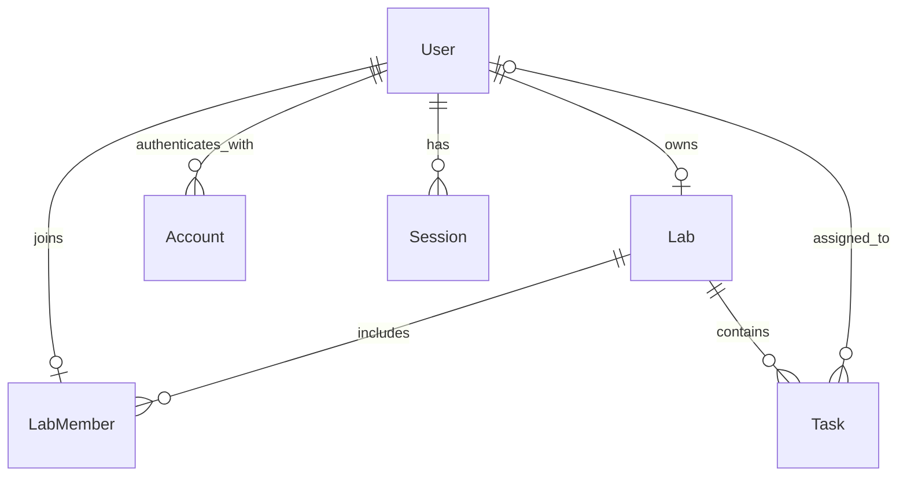
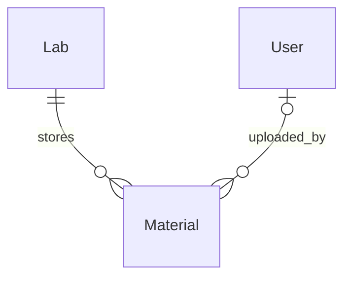

# DB設計案

更新日: 2026-09-28

状態: 初期設計案

## 設計方針

- PostgreSQLを使い、Prisma ORM 7でモデルとマイグレーションを管理する。
- 認証ユーザーとアプリの権限データを同じDBに置く。Google OAuthのUser/Account/SessionはAuth.js Prisma Adapterのモデルに合わせる。
- Labには複数Userが所属できるが、Userの所属Labは最大1つとする。`joinedAt` など所属自体の情報を持たせるため、明示的な `LabMember` を残す。
- 外部キーで存在する行を保証し、複合主キー・一意制約で重複を防ぐ。Lab所属やOwner確認は、すべてのサーバー側読み書きでも検証する。
- 不要な履歴テーブル、ロール階層、ソフト削除、資料メタデータはMVPに追加しない。

## ER図

`Lab.ownerId` はDB上ではuniqueではない。通常のアプリ操作ではOwnerも同じLabの `LabMember` として作られ、`LabMember.userId` がuniqueなので、Ownerが複数Labを持つ状態はLab作成処理のトランザクションで防ぐ。

`VerificationToken` はAuth.js Adapter互換のモデルとして用意するが、Google OAuthのみのMVPではログイン導線から使わない。

## モデル案

### User とAuth.js Adapterモデル

`User` はAuth.js Adapterのユーザー情報とプロフィール情報を持ち、少なくとも `id`、`name?`、`email?`、`emailVerified?`、`image?`、`userType?`、`studentNumber?` を含む。Adapter互換のためメール欄はnullableにできるが、Labメンバーをメールで追加する機能ではメールアドレスがあるUserだけを対象にする。メールアドレスには一意制約を置く。

- `userType` は `TEACHER` または `STUDENT` のプロフィール分類。Labの認可には使わない。
- `userType` と `studentNumber` は初回OAuthログイン時には未設定にできる。プロフィール完了時にUserTypeを必須にし、学生なら学生番号を必須、教員なら未設定とする条件をサーバー側で検証する。
- `studentNumber` はnullableな一意フィールド。PostgreSQLではNULLでない値の重複を拒否し、プロフィール未完了のUserは保持できる。
- 学生番号はアプリ内で一意とする。MVPは単一大学での利用を前提とする。

Adapterモデルは公式のPrisma Adapterスキーマに合わせる。

- `Account`：OAuth ProviderとProvider側アカウントIDを保持する。`[provider, providerAccountId]` を一意にする。
- `Session`：一意な `sessionToken`、Userへの外部キー、有効期限を持つ。Adapter利用時のDBセッションを保存する。
- `VerificationToken`：Adapterスキーマとの互換性のために定義する。Google OAuthのMVPフローでは使用しない。

### Lab

- `id`、`name`、`ownerId`、`createdAt`、`updatedAt`
- `ownerId` はUserへの必須外部キーで、削除は `Restrict` する。Ownerは独立したroleテーブルではなく `Lab.ownerId` で表す。
- DB単体では `ownerId` の重複を禁止しない。アプリケーションはLab未所属Userだけに作成を許可し、LabとOwnerの `LabMember` を同じトランザクションで作る。これにより通常の作成経路ではUserがOwnerになれるLabも最大1つとなる。

### LabMember

- `labId`、`userId`、`joinedAt`
- `@@id([labId, userId])` を複合主キーとして所属ペアを識別する。これは同一Userの同一Labへの重複登録を防ぐ。
- `userId` にunique制約を置き、同じUserを別Labへ登録できないようにする。unique indexはUserから所属Labを検索する用途にも使えるため、以前の通常indexは別に残さない。
- Userは0または1件のLabMemberを持ち、Labは複数のLabMemberを持てる。LabMemberは所属と `joinedAt` を保存する。
- `userId` uniqueがあると同じ所属ペアの重複も論理上防がれるが、複合主キーは所属ペアを表す識別子として維持する。
- `UserType` はプロフィール分類であり権限ロールではない。MVPの操作権限はLabの所属とOwnerで判定し、Ownerは `Lab.ownerId` と一致するメンバー1人として作成・メンバー管理処理で整合性を保つ。

### Task

- `id`、`labId`、`title`、`description?`、`assigneeId?`、`dueAt?`、`status`、`createdAt`、`updatedAt`
- `labId` は必須。タスクは必ず1つのLabに属する。
- `title` は必須、`description`・担当者・締切日時は任意。
- `status` は `TODO`、`IN_PROGRESS`、`DONE` のEnumで、初期値は `TODO`。
- `dueAt` は `DateTime? @db.Timestamptz(3)`。入力時刻をISO形式の日時として受け、MVPでは `Asia/Tokyo` で入力・表示する。
- Labのタスク一覧をLab・状態・締切で絞り込めるよう、`[labId, status, dueAt]` の複合インデックスを置く。
- `assigneeId` はUserへの任意外部キー。担当者候補がそのLabの `LabMember` であることは、タスクの作成・更新処理で確認する。

### Material（追加候補・未実装）

現在の [`docs/requirements.md`](requirements.md) では資料アップロードをMVP対象外としている。この節は将来追加する場合のDB設計案であり、現行のPrisma schemaやmigrationにはまだ含めない。

ファイル本体はPostgreSQLに保存せず、非公開のS3互換オブジェクトストレージに置く。PostgreSQLには資料の表示・認可に必要なメタデータと、ストレージ上のオブジェクトを特定するキーを保存する。ストレージの接続先やバケット名は環境設定で持ち、DBには公開URLを保存しない。

提案する `Material` のフィールドは次の通り。

| フィールド | 型・必須性 | 用途 |
| --- | --- | --- |
| `id` | 主キー | 資料レコードの識別子 |
| `labId` | 必須 | 所属Lab。資料の認可境界にも使う |
| `title` | 必須 | アプリ内で表示する資料名 |
| `description` | 任意 | 補足説明 |
| `originalFileName` | 必須 | アップロード時のファイル名。保存キーには使わない |
| `storageKey` | 必須・一意 | サーバーが生成するストレージ内のオブジェクト識別子 |
| `contentType` | 必須 | 検証済みのメディアタイプ |
| `sizeBytes` | 必須 | ファイルサイズ（byte）。想定する20MiB上限ならPostgreSQL `Int` の範囲内 |
| `uploadedById` | nullable | 登録したUser。User削除後も資料を残せるよう `SetNull` を提案 |
| `createdAt` / `updatedAt` | 必須 | 登録・更新日時 |

`Lab` は複数の `Material` を持ち、各 `Material` は必ず1つのLabに属する。`User` は複数資料を登録でき、各資料の登録者は0人または1人とする。アップロード時には登録者を設定するが、将来Userを削除してもLab資料を保つため、DB上の `uploadedById` はnullableにする案。

提案する制約と削除動作:

- `Material.labId` は `Lab.id` への必須外部キー。`onDelete: Restrict` とし、資料が残るLabの削除をDBでも拒否する。外部ストレージのファイルまでDBのCascadeだけで消せず、孤立ファイルを作るため。
- `Material.uploadedById` は `User.id` への任意外部キー。`onDelete: SetNull` とし、登録者Userが削除されても資料とファイルを残す。
- `storageKey` は一意にする。元ファイル名は利用者入力で重複し得るため一意にしない。
- Lab内一覧用に `[labId, createdAt]`、登録者から資料を検索・参照解除する用途に `[uploadedById]` のindexを置く。
- ファイル本体、バケット、ストレージ事業者、ダウンロードURLはDB列にしない。単一バケットを使う初期構成では、事業者を示す列を先回りして追加しない。

DB制約とアプリ側処理の境界:

- `labId` 外部キーはLabの存在を保証するが、アクセス権は保証しない。資料の一覧、プレビュー、ダウンロード、説明編集、削除の各サーバー処理で、セッションUserが対象Labの `LabMember` であることを毎回確認する。全メンバーに同じ資料操作を許す案。
- 20MiB上限、許可するファイル形式、Content-Typeの検証はDB制約にせず、アップロード処理で検証する。クライアント申告のContent-Typeだけを信用せず、必要に応じてファイル内容も確認する。
- アップロードでは、サーバー生成キーでストレージに保存してからDBレコードを作る。DB登録に失敗したら、保存したオブジェクトを可能な範囲で補償削除する。
- 削除では、ストレージ上のオブジェクトを削除してからDB行を削除する。ストレージ削除に失敗した場合はDB行を残し、再試行できるようにする。オブジェクトストレージとPostgreSQLをまたぐ単一トランザクションはないため、ストレージ削除後にDB削除だけが失敗する可能性は残る。再試行時にオブジェクトが既にない状態を成功として扱えるようにする。

この案では別のアップロード状態モデルやファイル履歴モデルを追加しない。孤立オブジェクトの自動検出・再試行が必要になった時点で、運用要件を確認してから別途設計する。

## 関係・制約の整理

| 関係 | 多重度 | DB上の表現 |
| --- | --- | --- |
| User → 所属LabMember | 1対0または1 | `LabMember.userId` のunique制約 |
| Lab → 所属LabMember | 1対多 | `LabMember.labId` 外部キー |
| User → 所有Lab | アプリ上は0または1 | `Lab.ownerId` 外部キー。OwnerもMemberになる作成トランザクションと `LabMember.userId` unique制約で保証 |
| Lab → Task | 1対多 | `Task.labId` 外部キー |
| User → 担当Task | 1対多（Task側は任意） | `Task.assigneeId` nullable外部キー |
| User → OAuth Account / Session | 1対多 | Auth.js Adapterの外部キー |

主な一意制約は `User.email`、`User.studentNumber`、`LabMember[labId, userId]` の複合主キー、`LabMember.userId`、`Account[provider, providerAccountId]`、`Session.sessionToken`。`LabMember.userId` uniqueは複合主キーより強い所属上限を表す。同じ値の `@@unique([labId, userId])` は重ねない。

## 外部キーと削除時の挙動

| 参照元 → 参照先 | 削除時 | 理由・アプリ側の扱い |
| --- | --- | --- |
| `Lab.ownerId` → `User.id` | `Restrict` | Ownerが所有するLabを残したままOwner Userを削除させない。アカウント削除機能はMVP対象外。 |
| `LabMember.labId` → `Lab.id` | `Cascade` | LabをDBから削除する場合、そのLabの所属行も残さない。Lab削除UIはMVP対象外。 |
| `LabMember.userId` → `User.id` | `Cascade` | User削除時に所属行を残さない。ただしOwnerの削除は上記FKで拒否される。 |
| `Task.labId` → `Lab.id` | `Cascade` | Lab削除時に属するTaskを孤立させない。 |
| `Task.assigneeId` → `User.id` | `SetNull` | 担当Userを削除してもTaskは保持し、担当だけ解除する。 |
| Auth.js `Account.userId` / `Session.userId` → `User.id` | `Cascade` | User削除時にOAuth連携・セッションを残さない。 |

TaskからLabMemberへの外部キーは設けず、Taskの担当者はUserを参照する。したがってDB外部キーだけでは「担当者が当該Labのメンバーであること」までは表現しない。タスク作成・更新時に、サーバーが `LabMember(labId, assigneeId)` を照会して保証する。これは単純なMVPモデルを保ちつつ、認可ルールをすべての更新処理で明示する設計。

Labメンバーを外す操作は、次を1つのDBトランザクションで行う。

1. 対象Lab内でそのUserが担当しているTaskの `assigneeId` を `NULL` にする。
2. 対象の `LabMember` 行を削除する。

Owner本人またはOwnerの所属を削除する操作は拒否する。Owner移譲はMVPに含めない。Taskの完全削除は、対象Labのメンバーなら実行できる。

## 認証・認可との関係

- Auth.jsセッションから、現在のUser IDをサーバーで取得する。
- `User.userType` はプロフィール分類であり、Lab操作権限の判定には使わない。プロフィール未完了Userはプロフィール入力だけを許可し、Lab機能はサーバー側で拒否する。
- プロフィール保存時はUserTypeを必須にし、学生の場合は一意な学生番号を必須、教員の場合は学生番号なしとする条件をサーバー側で検証する。DBには条件付き必須のCHECK制約を置かない。
- 認証済みかどうかだけでLabデータを返さない。読み取りクエリは対象Labの `LabMember` を条件に含める。
- Taskの作成・更新・削除ごとに対象Taskの `labId` と現在のUserの所属を確認する。クライアントから送られた `labId` やUser IDを信用しない。
- メンバー追加・削除処理では、対象Labの `ownerId` とセッションUser IDをサーバー側で比較する。
- UIのボタン制御はUX向けに行ってもよいが、認可の根拠にはしない。
- PostgreSQL外部キーは参照先が存在することを保証し、所属に基づく権限はサーバー側の認可処理が保証する。
- 初回OAuthログインとプロフィール完了は別の段階とし、プロフィール項目がnullableなのはAuth.js AdapterがUserを作成する時点ではプロフィール入力がまだ行われていないため。

## 実装時の依存メモ

Auth.js Prisma AdapterのモデルはAdapter公式スキーマと揃える。初期計画ではPrisma ORM 7のPostgreSQLドライバーアダプターを使い、ドキュメントどおりの `@prisma/adapter-pg` と `pg` の接続方式を確認する。ORMメジャーを上げる際はAuth.js Adapterとの互換性とマイグレーションを先に確認する。

参考資料:

- [Prisma: Auth.jsとNext.js](https://www.prisma.io/docs/guides/authentication/authjs/nextjs)
- [Prisma: 複合ID・複合一意制約](https://docs.prisma.io/docs/orm/prisma-client/special-fields-and-types/working-with-composite-ids-and-constraints)
- [Prisma: Referential actions](https://www.prisma.io/docs/orm/v6/prisma-schema/data-model/relations/referential-actions)
- [PostgreSQL: Date/Time Types](https://www.postgresql.org/docs/current/datatype-datetime.html)
